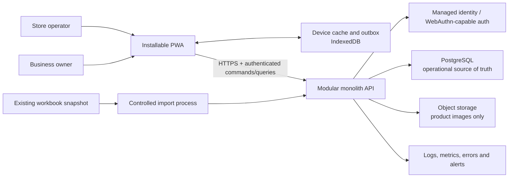
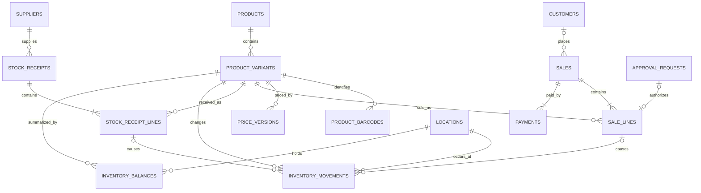

# ItsMyToy Store Operating System

## Engineering Foundation Specification

**Version:** 0.3  
**Date:** 21 July 2026  
**Status:** Architecture and technology baseline accepted for walking-skeleton implementation  
**Companion documents:** `PHASE_1_PRODUCT_BLUEPRINT.md`, `BUSINESS_DECISIONS.md`, `TECHNOLOGY_EVALUATION_ADR.md`

---

## 1. Purpose

This document defines the production engineering foundation for the ItsMyToy Store Operating System. It is written for a developer, architect, security reviewer or future maintainer who has no access to the conversations that produced it.

It specifies:

- the logical system architecture;
- module boundaries;
- database entities, constraints and indexes;
- money, inventory and pricing invariants;
- transaction and concurrency rules;
- offline synchronization behaviour;
- authentication, authorization and database security;
- threat controls;
- test-driven development expectations;
- performance, reliability, backup and monitoring targets;
- spreadsheet migration controls;
- architecture decisions and implementation gates.

This is not application code. It is the contract that production code must satisfy.

---

## 2. Business and system context

ItsMyToy is a small children’s-toy retailer and wholesaler operated by two business owners. Family members or employees may operate the physical shop when an owner is absent.

The current and only operational system is a manually maintained spreadsheet workbook named **ItsMyToy - Inventory & Accounting**, shared through Google Sheets. It contains product, inventory, sales and customer records. Spreadsheet formulas and calculated cells can be overwritten accidentally, and completed records do not have reliable immutability or audit controls.

The new system will become the operational source of truth after a controlled migration. Statutory invoicing, tax compliance, accounting ledgers, wholesale ordering and customer-engagement automation are outside the first production boundary.

### Initial operating assumptions

These figures are design envelopes, not confirmed business forecasts:

- one business;
- one physical stock location initially;
- fewer than 20 active human users;
- fewer than 20 concurrently enrolled devices;
- up to 10,000 active SKUs;
- up to 5,000 sale lines per day;
- intermittent internet connectivity in the shop;
- Indian rupees as the only Phase 1 currency;
- Asia/Kolkata as the business display timezone.

If any assumption changes materially, the related architecture decision must be reviewed.

---

## 3. Engineering principles

1. **Server authority:** the client may propose an action, but the server validates identity, permission, price and stock before committing it.
2. **Immutable completed records:** completed sales, receipts and stock movements are never edited or deleted.
3. **Database-enforced integrity:** primary keys, foreign keys, uniqueness and check constraints protect invariants even when application code is wrong.
4. **Atomic business actions:** completing a sale or receipt succeeds fully or fails fully.
5. **Idempotent commands:** retrying the same request cannot duplicate a sale, payment or stock movement.
6. **Least privilege:** users, devices, application processes and database roles receive only the access they require.
7. **Sensitive-data minimization:** a store operator never downloads purchase cost, profit or owner-only price limits.
8. **Observable failure:** unsynced, rejected or conflicting actions must be visible; silent data loss is unacceptable.
9. **Simple deployment:** one modular application and one relational database are preferred over distributed services.
10. **Test business risk first:** money, inventory, authorization, concurrency and migration rules require tests before implementation.
11. **Disposable prototype separation:** any UX prototype is reference material only and is not copied into the production application.
12. **No speculative infrastructure:** microservices, message brokers, Kubernetes and a data warehouse are excluded until measured requirements justify them.

---

## 4. Selected logical architecture

### 4.1 Architectural style

Use a **modular monolith**:

- one installable mobile-first Progressive Web App;
- one server application exposing an authenticated HTTP API;
- one PostgreSQL database;
- optional object storage for product images;
- one managed identity service or standards-compliant authentication component;
- no direct client access to database tables;
- no message broker in Phase 1.

The modules live in one deployable server application but may not write directly into another module’s tables except through an explicit domain service or transaction coordinator.

### 4.2 System context



### 4.3 Why a modular monolith

- The expected user and transaction volume is small for a relational database.
- Sales, payments and inventory must commit in one database transaction.
- One deployment is easier to test, secure, back up and operate.
- Module boundaries preserve future extraction options without paying distributed-system costs now.

### 4.4 Module boundaries

| Module | Owns | May call |
|---|---|---|
| Identity & Access | Application users, roles, permissions, devices, sessions | Audit |
| Catalogue | Products, variants, barcodes, categories, rack defaults | Pricing, Audit |
| Pricing | Versioned MRP, standard price and role price floors | Approval, Audit |
| Sales | Draft/completed sales, sale lines, channels | Pricing, Inventory, Payment, Customer, Approval, Audit |
| Payment | Payment records and reconciliation attributes | Sales, Audit |
| Inventory | Movement ledger, balance projection and stock states | Catalogue, Audit |
| Receiving | Suppliers, stock receipts and receipt lines | Catalogue, Pricing, Inventory, Audit |
| Customer | Minimal retail-customer identity and contact data | Audit |
| Approval | Discount and stock-adjustment approval lifecycle | Identity, Audit |
| Reporting | Read models and operational dashboards | Read-only access to approved projections |
| Import | Workbook staging, validation, quarantine and reconciliation | Catalogue, Sales, Customer, Inventory, Audit |
| Audit | Append-only security and business events | No writes to other modules |

Circular module writes are prohibited. Cross-module operations use one application transaction coordinator.

---

## 5. Source-of-truth rules

### 5.1 Product identity

- A product describes shared commercial information such as name, category and brand.
- A product variant is the sellable inventory unit.
- Every variant has exactly one immutable SKU after the SKU has appeared in a completed business record.
- A barcode maps to exactly one active variant.
- Multiple barcodes may map to the same variant.
- Products and variants are archived, never hard-deleted after use.

### 5.2 Money

- Store all money as integer paise using a signed 64-bit database integer.
- Do not use floating-point values for prices, totals, discounts or profit.
- Phase 1 currency is fixed to INR.
- The server calculates all line totals and derived discounts.
- The client never sends a trusted line total or profit value.
- Historical sale lines store price and cost snapshots; later price changes never alter historical results.

### 5.3 Pricing

For an active price version:

`owner floor <= trusted-operator floor <= store-operator floor <= standard selling price <= MRP`

All values must be positive. Purchase cost may be above an owner floor because an owner may deliberately approve a below-cost clearance or damaged-box sale; this requires an explicit recorded reason.

Customer-facing and internal measures remain separate:

- `customer savings = MRP - final unit price`
- `internal markdown = standard selling price - final unit price`
- `gross product profit = final unit price - purchase-cost snapshot`
- `line total = quantity × final unit price`

### 5.4 Inventory

- The inventory movement ledger is the audit source of truth.
- The inventory balance table is a transactionally maintained projection used for fast availability checks.
- Users never edit either value directly.
- Every balance change and its matching movement are committed in the same transaction.
- A reconciliation process recalculates balances from movements and raises an alert on any mismatch.

### 5.5 Completed records

- A completed sale is immutable.
- A completed receipt is immutable.
- A stock movement is immutable.
- A correction creates a compensating record referencing the original record.
- Audit records are append-only.

---

## 6. Database design

PostgreSQL is selected as the production relational database because the system depends on transactional writes, constraints, row-level locking, deterministic concurrency and reliable backup tooling.

### 6.1 Shared column conventions

- Primary keys: UUID generated by the server or database.
- Human-readable sale/receipt numbers: separate generated fields; never primary keys.
- Timestamps: `timestamptz`, stored in UTC and displayed in Asia/Kolkata.
- Mutable configuration rows: include `version integer` for optimistic concurrency.
- Completed-record timestamps: separate `completed_at` field.
- Soft lifecycle: `archived_at` or controlled status, not `is_deleted` plus hard deletion.
- Free-text notes: bounded length and treated as untrusted input.
- Phone numbers: normalized before uniqueness comparison.

### 6.2 Core tables

#### `locations`

One row for each physical stock location.

Key fields:

- `id`
- `code`, unique
- `name`
- `timezone`
- `active`

Phase 1 creates one location but retains location identity in stock records so a future second location does not require rewriting the ledger.

#### `app_users`

Maps an authenticated identity to business permissions.

Key fields:

- `id`
- `external_auth_subject`, unique
- `display_name`
- `role`: `OWNER`, `TRUSTED_OPERATOR`, `STORE_OPERATOR`
- `active`
- `created_at`, `disabled_at`

No password hash is stored here when a managed identity provider is used.

#### `devices`

Tracks enrolled devices and supports revocation.

Key fields:

- `id`
- `user_id`
- `device_public_id`, unique
- `display_name`
- `last_seen_at`
- `last_catalog_revision`
- `revoked_at`

#### `categories`

Key fields:

- `id`
- `name`
- `parent_id`, nullable self-reference
- unique normalized name within the same parent

#### `products`

Key fields:

- `id`
- `name`
- `category_id`
- `brand`, nullable
- `description`, nullable
- `image_object_key`, nullable
- `created_by`, `created_at`, `archived_at`

#### `product_variants`

The sellable SKU record.

Key fields:

- `id`
- `product_id`
- `sku`, unique and normalized
- `variant_label`, nullable
- `unit_type`: initially `UNIT` or `PACK`
- `pack_size`, positive and default `1`
- `default_rack_code`, nullable
- `created_by`, `created_at`, `archived_at`
- `version`

Important constraints:

- `pack_size >= 1`
- archived variants cannot be added to a new sale or receipt
- SKU changes are rejected after the variant appears in a completed record

#### `product_barcodes`

Key fields:

- `id`
- `variant_id`
- `barcode_value`, globally unique after normalization
- `barcode_type`, nullable
- `active`

#### `price_versions`

Versioned product pricing. Updating price means closing the current version and inserting a new version.

Key fields:

- `id`
- `variant_id`
- `purchase_cost_paise`
- `mrp_paise`
- `standard_price_paise`
- `store_operator_floor_paise`
- `trusted_operator_floor_paise`
- `owner_floor_paise`
- `effective_from`
- `effective_until`, nullable
- `created_by`, `created_at`

Important constraints:

- all money values are positive integers;
- floor ordering and `standard_price <= MRP` are enforced;
- only one active price version per variant, enforced by a partial unique index;
- effective periods may not overlap for one variant.

#### `customers`

Key fields:

- `id`
- `name`
- `normalized_phone`, nullable
- `whatsapp_phone`, nullable
- `whatsapp_consent_at`, nullable
- `email`, nullable
- `locality`, nullable
- `source`, nullable
- `created_at`, `archived_at`

Important constraints:

- normalized phone is unique when present;
- a Guest sale uses `customer_id = null`; do not create a shared “Anonymous” customer row;
- child name, birthday and age are not collected or migrated in Phase 1 without a documented purpose and privacy decision.

#### `suppliers`

Key fields:

- `id`
- `name`
- `normalized_phone`, nullable
- `notes`, nullable
- `active`

#### `sales`

Key fields:

- `id`
- `sale_number`, unique
- `status`: `DRAFT`, `COMPLETED`, `CANCELLED`, `PARTIALLY_RETURNED`, `RETURNED`
- `location_id`
- `seller_user_id`
- `device_id`
- `customer_id`, nullable
- `channel`
- `created_at`, `completed_at`, `cancelled_at`
- `version`
- `completion_command_id`, unique when present

Rules:

- a Draft may change through version-checked commands;
- completion requires at least one valid line and matching payment total;
- completed fields are immutable;
- sale total is derived from sale lines, not accepted from the client.

#### `sale_lines`

Key fields:

- `id`
- `sale_id`
- `variant_id`
- `quantity`, positive integer
- `price_version_id`
- `mrp_snapshot_paise`
- `accounting_cogs_paise`, allocated from the locked moving weighted-average inventory value
- `replacement_unit_cost_paise`, copied from the latest landed cost
- `standard_price_snapshot_paise`
- `final_unit_price_paise`
- `approval_id`, nullable

Rules:

- quantity is positive;
- selling-price snapshots are copied by the server from the selected active price version;
- accounting COGS and replacement cost are frozen by the server when the sale completes;
- `line total` is calculated, never written as an independent business input;
- a below-role-floor price requires a valid, unused approval tied to this draft line and price version.

#### `payments`

The schema supports multiple payments per sale even if the initial UI permits one.

Key fields:

- `id`
- `sale_id`
- `mode`: configured controlled value such as `CASH`, `UPI`, `CARD`
- `amount_paise`, positive
- `reference`, nullable
- `received_by`
- `created_at`

The server verifies that payment sum equals sale-line sum before completion.

#### `stock_receipts`

Key fields:

- `id`
- `receipt_number`, unique
- `status`: `DRAFT`, `COMPLETED`, `VOIDED`
- `supplier_id`
- `supplier_invoice_reference`, nullable
- `location_id`
- `created_by`, `created_at`, `completed_at`
- `completion_command_id`, unique when present
- `version`

A partial unique index warns or blocks an active duplicate supplier/invoice reference according to the final business rule.

#### `stock_receipt_lines`

Key fields:

- `id`
- `receipt_id`
- `variant_id`
- `sellable_quantity`, non-negative
- `damaged_quantity`, non-negative
- `unit_cost_paise`, positive
- `confirmed_mrp_paise`
- `confirmed_standard_price_paise`
- `rack_code`, nullable

At least one of sellable or damaged quantity must be positive.

#### `stock_adjustments`

Key fields:

- `id`
- `variant_id`
- `location_id`
- `stock_state`
- `quantity_delta`, non-zero
- `reason_code`
- `note`
- `status`: `REQUESTED`, `APPROVED`, `REJECTED`, `APPLIED`
- `requested_by`, `decided_by`, `applied_by`
- timestamps for each transition
- `application_command_id`, unique when applied

#### `approval_requests`

Used initially for discount approval.

Key fields:

- `id`
- `type`: initially `DISCOUNT`
- `sale_line_id`
- `price_version_id`
- `requested_unit_price_paise`
- `approved_unit_price_paise`, nullable
- `reason`
- `status`: `PENDING`, `APPROVED`, `REJECTED`, `EXPIRED`, `CONSUMED`
- `requested_by`, `decided_by`
- `requested_at`, `decided_at`, `expires_at`, `consumed_at`

Rules:

- only an owner can approve or reject;
- an approval is tied to one line, quantity and price version;
- an approval expires when the draft line changes;
- a completed sale consumes the approval exactly once.

#### `inventory_movements`

Append-only audit ledger.

Key fields:

- `id`
- `variant_id`
- `location_id`
- `stock_state`: `SELLABLE`, `DAMAGED`, `RETURN_TO_SUPPLIER`
- `quantity_delta`, non-zero signed integer
- `movement_type`: `OPENING`, `RECEIPT`, `SALE`, `SALE_REVERSAL`, `CUSTOMER_RETURN`, `SUPPLIER_RETURN`, `DAMAGE`, `LOSS`, `SAMPLE`, `COUNT_ADJUSTMENT`
- one explicit origin reference: `sale_line_id`, `receipt_line_id`, `adjustment_id` or `import_row_id`
- `reversal_of_movement_id`, nullable
- `performed_by`
- `created_at`
- `command_id`

Important constraints and indexes:

- `quantity_delta != 0`;
- exactly one origin reference is non-null;
- unique `(command_id, variant_id, location_id, stock_state, movement_type)` prevents duplicate sync effects;
- index `(variant_id, location_id, stock_state, created_at)` supports history and reconciliation;
- database runtime role has no update or delete privilege on this table.

#### `inventory_balances`

Fast availability projection.

Key fields:

- `variant_id`
- `location_id`
- `stock_state`
- `quantity`
- `inventory_value_paise`
- `latest_landed_cost_paise`
- `updated_at`
- `version`

Primary key: `(variant_id, location_id, stock_state)`.

Rules:

- updated only inside the same transaction that inserts a movement;
- receipts add quantity and landed value; sales subtract quantity and their allocated weighted-average COGS;
- average unit cost is derived from inventory value divided by quantity and is never an independently editable field;
- selling the final units consumes the entire remaining inventory value so rounding cannot leave an orphan balance;
- never exposed as an editable API resource;
- sellable quantity cannot become negative without an explicit owner-approved exception policy;
- reconciliation compares it to the sum of ledger movements.

#### `audit_events`

Append-only security and business history.

Key fields:

- `id`
- `actor_user_id`, nullable for system/import events
- `device_id`, nullable
- `event_type`
- `entity_type`, `entity_id`
- bounded before/after metadata with sensitive fields redacted
- `reason`, nullable
- `request_id`
- `created_at`

Runtime roles may insert but never update or delete audit events.

#### `import_batches`, `import_rows`, `import_errors`

Track workbook snapshots, normalized staged data, validation results, quarantined rows, source coordinates and reconciliation totals. Imported records keep their source sheet, row and original identifier for traceability.

### 6.3 Relationship overview



---

## 7. Transaction and concurrency design

### 7.1 Complete-sale transaction

The server performs these steps in one database transaction:

1. Authenticate user and validate active device.
2. Look up `completion_command_id`; return the original result if already processed.
3. Lock the Draft sale row.
4. Verify Draft version and seller permission.
5. Sort affected variant IDs deterministically.
6. Lock corresponding sellable `inventory_balances` rows using row-level locks in that order.
7. Load current active price versions.
8. Recalculate role floors, approval requirements, line totals and payment total on the server.
9. Verify sufficient stock.
10. Insert immutable price/cost snapshots on sale lines.
11. Insert payments.
12. Insert outward inventory movements.
13. Decrement balance rows.
14. Consume linked approvals.
15. Mark sale Completed.
16. Append audit events.
17. Commit.

If any step fails, the entire transaction rolls back.

```mermaid
sequenceDiagram
    participant C as PWA
    participant A as API
    participant D as PostgreSQL
    C->>A: CompleteSale(command_id, draft_id, version)
    A->>D: BEGIN
    A->>D: Check command id and lock sale
    A->>D: Lock balance rows in SKU order
    A->>D: Validate prices, approval, payment and stock
    A->>D: Insert lines/payments/movements; update balances
    A->>D: Mark sale completed; append audit
    A->>D: COMMIT
    A-->>C: Completed sale or stable rejection code
```

### 7.2 Concurrent last-unit sale

Two transactions attempting to sell the same final unit lock the same balance row. The first transaction commits. The second then observes zero available stock and receives `INSUFFICIENT_STOCK`. It cannot produce a negative balance silently.

### 7.3 Deadlock control

- Lock all balance rows in ascending variant-ID order.
- Keep transactions short; never wait for human input inside a transaction.
- Retry a bounded number of database deadlock/serialization failures using the same command ID.
- Log exhausted retries as operational errors.

### 7.4 Complete-receipt transaction

One transaction validates receipt lines, locks relevant balances in deterministic order, inserts sellable/damaged movements, updates balance projections, records price-version changes when approved, completes the receipt and appends audit events.

### 7.5 Cancellation and correction

- Completed rows are not updated to change financial or stock facts.
- Cancellation creates compensating stock movements and changes only the lifecycle status and cancellation metadata.
- Stock correction uses an approved adjustment record and a new movement.
- Every reversal references the original record.

PostgreSQL documents that row-level locks block conflicting writers until the transaction ends and recommends consistent lock ordering to reduce deadlocks: <https://www.postgresql.org/docs/current/explicit-locking.html>.

---

## 8. API and command contract

### 8.1 General rules

- HTTPS only.
- Authenticated secure-cookie or equivalent standards-based session.
- The PWA and offline sync engine use explicit versioned `/api/v1` HTTP/JSON endpoints implemented by the Next.js/Node.js backend.
- Next.js Server Actions may support web-only UI convenience but are not the sole business transaction or synchronization contract.
- JSON request and response contracts are versioned.
- State-changing requests require a client-generated UUID command ID.
- Server returns stable machine-readable error codes and human-readable messages.
- Monetary values cross the API as integer paise, not decimals.
- The server ignores/rejects client-provided derived totals.
- Operator responses omit purchase cost, profit and owner-only floors entirely.
- Draft mutations require the current version number.
- Pagination is mandatory for activity and audit history.

### 8.2 Critical commands

| Command | Required guarantees |
|---|---|
| Create/Update Draft Sale | Version checked; no inventory effect |
| Request Discount Approval | Bound to exact draft line, quantity, price version and requested price |
| Decide Approval | Owner-only, expiry checked, audited |
| Complete Sale | Idempotent, atomic price/payment/stock validation |
| Cancel Sale | Owner-authorized compensating transaction |
| Create/Update Draft Receipt | Version checked; no stock effect |
| Complete Receipt | Idempotent, atomic movement/balance update |
| Request/Apply Stock Adjustment | Reasoned, authorized and audited |
| Sync Offline Commands | Ordered per device, idempotent per command, independent result per command |

### 8.3 Query rules

- Product scan lookup accepts normalized barcode or exact SKU.
- Catalogue sync returns only active variants and role-permitted pricing fields.
- Owner inventory history joins movements to their source records.
- Dashboard queries use read projections; they never mutate operational records.
- Query authorization is tested independently from UI visibility.

---

## 9. Offline and synchronization architecture

### 9.1 Device storage

The PWA may store these items in IndexedDB:

- active SKU and barcode lookup data;
- product name, image thumbnail reference and rack code;
- MRP, standard price and the signed-in user’s permitted floor only;
- last-known stock and catalogue revision;
- locally created Draft cart;
- queued command envelope and non-sensitive payload;
- sync results and rejection reasons.

It must not cache:

- purchase cost or profit for a non-owner;
- owner-only price floors for a non-owner;
- full customer database;
- authentication secrets;
- unrestricted audit or financial exports.

Service workers and IndexedDB are established PWA mechanisms for cached assets and structured offline data: <https://web.dev/learn/pwa/assets-and-data>.

### 9.2 Offline command envelope

Every queued command contains:

- command ID UUID;
- device ID;
- authenticated user ID/session binding;
- command type and schema version;
- local creation timestamp;
- last-known catalogue revision;
- draft entity version;
- payload;
- retry count and last result.

### 9.3 Accepted Phase 1 offline policy

- Catalogue lookup and Draft cart creation work offline.
- A normal-price Guest sale may be queued when cached stock is above the configured offline safety reserve.
- Below-floor prices, new products, price changes, approvals and stock adjustments require online validation.
- The last known sellable unit cannot be completed offline.
- Offline customer PII collection is disabled initially; the sale remains Guest until synchronized and optionally linked later.
- The UI displays Offline, last-sync time and queued-command count on every transactional screen.

The business owners accepted a one-unit offline safety reserve and a maximum 12-hour offline authentication grace window in BD-08 and BD-09.

### 9.4 Reconnect behaviour

1. PWA refreshes session/device status.
2. Commands are sent in local creation order.
3. The server handles each command idempotently.
4. A success stores the server record ID and removes the command from the active outbox.
5. A business rejection remains visible for manual resolution.
6. An authentication or schema error stops further processing and alerts the user.
7. Catalogue and balance deltas refresh after command processing.

### 9.5 Conflict codes

At minimum:

- `INSUFFICIENT_STOCK`
- `PRICE_VERSION_CHANGED`
- `PRICE_BELOW_ROLE_FLOOR`
- `APPROVAL_REQUIRED`
- `APPROVAL_EXPIRED`
- `DRAFT_VERSION_CONFLICT`
- `DEVICE_REVOKED`
- `SESSION_EXPIRED`
- `PRODUCT_ARCHIVED`
- `COMMAND_SCHEMA_UNSUPPORTED`

No conflict is converted silently into a different sale price or quantity.

---

## 10. Authentication and authorization

### 10.1 Identity requirements

- Every person has an individual account; shared accounts are prohibited.
- Owners invite/activate store operators.
- Owners require multi-factor authentication or a passkey.
- A standards-compliant managed identity provider is preferred over custom password storage.
- WebAuthn/passkeys are preferred where supported because they use scoped public-key credentials: <https://www.w3.org/TR/webauthn/all/>.
- Recovery procedures must not allow a store operator to take over an owner account.

### 10.2 Sessions and devices

- Use secure, HttpOnly and SameSite cookies when cookie sessions are selected.
- Rotate session identifiers after authentication and privilege changes.
- Shorten owner session lifetime on shared devices.
- Allow owners to list and revoke devices.
- A revoked/disabled user or device cannot sync queued commands.
- Sensitive cached data is cleared on logout, role change or device revocation at next contact.
- The offline grace period is bounded and documented.

### 10.3 Authorization matrix

| Capability | Store operator | Trusted operator | Owner |
|---|---:|---:|---:|
| Scan/search product | Yes | Yes | Yes |
| View permitted sell price | Yes | Yes | Yes |
| View purchase cost/profit | No | No | Yes |
| Complete within-floor sale | Yes | Yes | Yes |
| Approve discount | No | No | Yes |
| Receive existing SKU | No by default | Configurable | Yes |
| Create/change SKU or barcode | No | No | Yes |
| Request stock adjustment | No by default | Yes | Yes |
| Apply stock adjustment | No | No | Yes |
| Cancel completed sale | No | No | Yes |
| Export customer/sales data | No | No | Yes |
| Manage users/devices | No | No | Yes |

Authorization is enforced at the API/domain layer and tested against direct API calls. Hiding a button is not authorization.

---

## 11. Database security

### 11.1 Network and credentials

- Database is not publicly reachable from client devices.
- Only the server and controlled administrative path can connect.
- TLS is required in transit.
- Credentials are stored in the deployment secret manager, never source control or client bundles.
- Production, staging and development use separate databases and credentials.

### 11.2 Database roles

Use separate roles:

- **migration role:** may create/alter schema; unavailable to the running application;
- **runtime role:** minimum CRUD privileges required by the server;
- **reporting/read role:** read-only approved views where needed;
- **backup/restore role:** managed separately according to provider tooling.

The runtime role has no update/delete privilege on `inventory_movements` or `audit_events`. It uses controlled insert paths and compensating records.

### 11.3 Constraints as defense

- Foreign keys on all concrete relationships.
- Unique SKU, barcode, command ID and active price-version constraints.
- Check constraints on quantities, money and price ordering.
- No generic client-supplied table/column names.
- Parameterized queries only.
- Database migrations are versioned, reviewed and executed by CI/CD or an authorized operator.

### 11.4 Backups

- Encrypted automated backups.
- Point-in-time recovery when supported by the chosen provider.
- Daily backup verification signal.
- Quarterly restore drill into an isolated environment.
- Backup access restricted and audited.
- Target recovery point: 15 minutes.
- Target recovery time: 4 hours.

These targets must be confirmed against hosting cost before production approval.

---

## 12. Threat model and security controls

Target **OWASP ASVS Level 2** as the application-security baseline because the system contains customer contact data and business-sensitive financial information. ASVS covers architecture, authentication, sessions, access control, validation, cryptography, logging, data protection, communications, business logic, APIs and configuration: <https://owasp.org/www-project-application-security-verification-standard/>.

| Threat | Example | Required controls |
|---|---|---|
| Broken access control | Store operator requests owner cost endpoint | Server authorization, role-filtered DTOs, negative authorization tests |
| Price tampering | Client modifies final price or role floor | Server price calculation, signed-in role lookup, approval validation |
| Stock replay/duplication | Offline command sent repeatedly | Unique command ID and database idempotency constraints |
| Concurrent overselling | Two devices sell final unit | Balance-row locks, deterministic order, atomic transaction |
| Insecure direct object reference | Operator guesses another sale/customer ID | Ownership/role checks on every resource query |
| Lost device | Authenticated phone is stolen | Device revocation, short lock, bounded offline grace, minimal cache |
| Owner-account takeover | Attacker gains full control | Passkey/MFA, secure recovery, alerts for new devices |
| Customer-data leakage | Logs contain phone numbers | Redaction, restricted exports, no PII in analytics/error logs |
| Malicious input | Notes contain script/CSV formulas | Server validation, output encoding, export escaping, CSP |
| Session/CSRF attack | Forged state-changing request | Secure SameSite cookies, CSRF defense, origin checks |
| Database credential leakage | Secret committed in repository | Secret scanning, managed secrets, rotation process |
| Supply-chain compromise | Vulnerable dependency | Locked dependencies, automated vulnerability scan, minimal dependencies |
| Import corruption | Spreadsheet formula/invalid price becomes live data | Staging, strict parsing, quarantine, reconciliation, source coordinates |
| Audit destruction | User hides a correction | Append-only tables, restricted DB privileges, backup retention |
| Denial of service | Repeated scan/search/API requests | Rate limits, payload limits, timeouts, monitoring |

### Security release gate

Before production:

- threat model reviewed;
- owner and operator authorization tests pass;
- secrets and dependency scans pass;
- security headers and cookie attributes verified;
- rate and payload limits configured;
- backup restore demonstrated;
- no high-severity unresolved security finding;
- sensitive-field exposure test confirms operator payloads contain no costs/profits;
- an external security review is considered before storing significant customer data or enabling public internet signup.

---

## 13. Privacy and data handling

- Collect only data needed for the documented operational purpose.
- Guest sales do not require a customer record.
- Customer phone must not become mandatory merely to improve marketing data.
- Child name, age and birthday are excluded from Phase 1 migration until purpose, consent, access and retention are explicitly decided.
- Store operators see only customer data needed to complete the current task.
- Owner-only exports are audited and protected against spreadsheet formula injection.
- Logs and metrics exclude customer phone, email, notes, tokens and payment secrets.
- Define retention, correction, export and deletion/anonymization procedures before production customer migration.
- Payment card details are never stored; only payment mode and an allowed external reference are recorded.

Applicable legal and tax obligations require qualified local review before production; this document does not define legal compliance.

---

## 14. Test-driven development strategy

### 14.1 TDD rule

For every money, stock, permission, idempotency or migration invariant:

1. write a failing test that describes the business rule;
2. implement the minimum code to pass;
3. refactor without changing behaviour;
4. run the full relevant suite.

TDD is required for business logic and transaction boundaries. It is not used to create low-value tests for static copy, colours or framework internals.

### 14.2 Test layers

| Layer | Purpose | Uses real database? |
|---|---|---:|
| Domain unit tests | Pricing, totals, role floors, state transitions | No |
| Database integration tests | Constraints, transactions, locks, idempotency | Yes, PostgreSQL |
| API tests | Authentication, authorization, validation, error contracts | Yes |
| Browser end-to-end tests | Critical mobile workflows | Yes |
| Migration tests | Parse, quarantine and reconciliation | Yes |
| Security tests | Negative permissions, headers, payload exposure | Yes where applicable |
| Load tests | Performance budgets and concurrency | Yes in isolated environment |

Mocks may isolate external identity/object-storage services, but PostgreSQL transaction tests must use real PostgreSQL rather than an in-memory substitute.

### 14.3 Mandatory domain tests

#### Pricing

- exact store-operator floor is accepted;
- one paise below the floor requires approval;
- approval is invalid after quantity, price version or target price changes;
- approval is consumed once;
- customer savings and internal markdown use different baselines;
- integer-paise calculations produce exact line totals;
- owner below-cost sale requires a recorded reason.

#### Inventory

- 3 units at ₹400 plus 10 at ₹500 produce ₹6,200 inventory value and ₹476.92 displayed weighted-average cost;
- selling 4 units allocates ₹1,907.69 COGS, leaves ₹4,292.31 inventory value and records ₹600 replacement loss at a ₹350 unit selling price;
- completing quantity 2 creates movement `-2` and balance change `-2`;
- retrying the same command produces no second movement;
- two concurrent final-unit sales yield one success and one rejection;
- receiving sellable and damaged quantities updates separate states;
- cancellation creates the exact compensating movement;
- ledger reconciliation equals the balance projection;
- a completed record cannot be edited.

#### Authorization

- store operator cannot create SKU/barcode;
- store operator response contains no purchase-cost or profit fields;
- trusted-operator receiving follows explicit permission;
- only owner can approve, adjust, cancel or export;
- disabled user and revoked device cannot sync.

#### Offline synchronization

- command retry returns the original result;
- stale Draft version returns a stable conflict;
- changed price version does not silently alter price;
- insufficient stock preserves the rejected command for resolution;
- unsupported command schema stops sync safely.

#### Migration

- workbook unit price is never interpreted as line total without an explicit mapping;
- zero-price sales are quarantined;
- missing SKU references are quarantined;
- duplicate SKU/barcode is rejected;
- opening quantity becomes an opening movement;
- imported sale totals reconcile to quantity × unit price;
- customer totals are derived, not trusted from workbook formulas.

### 14.4 CI quality gate

Every production change must pass:

- format/lint;
- static type checks when applicable;
- domain tests;
- PostgreSQL integration tests;
- API authorization tests;
- critical end-to-end flow;
- dependency vulnerability scan;
- secret scan;
- migration forward test on a clean database;
- migration compatibility test against a recent production-like schema;
- build artifact verification.

No release is made from a red pipeline.

---

## 15. Performance and capacity targets

Targets are measured at the 95th percentile under the initial design envelope.

| Operation | Target |
|---|---:|
| Cached barcode/SKU lookup on device | under 50 ms |
| Online product query | under 300 ms end-to-end |
| Complete ordinary sale | under 700 ms end-to-end |
| Owner dashboard | under 2 seconds |
| Initial interactive load on normal mobile connection | under 3 seconds |
| Repeat/offline application launch | under 1.5 seconds |
| First sync acknowledgement after reconnect | under 1 second |
| Sync 100 small queued commands after reconnect | under 10 seconds, excluding conflicts |

### Performance rules

- Index barcode, normalized SKU, sale date, movement history and pending approvals.
- Prevent unbounded list queries.
- Avoid calculating stock by summing the complete ledger during every scan; use the balance projection.
- Reconcile ledger and projection asynchronously, but update both transactionally.
- Serve product scans from the permitted IndexedDB catalogue first and refresh by revision/delta in the background.
- Complete an ordinary sale through one server command and one database transaction, not a chain of client round trips.
- Run the Node.js application and PostgreSQL in the same Railway Singapore environment and use the private `DATABASE_URL`.
- Keep production serverless sleeping disabled.
- Routine authenticated business requests must not synchronously contact the external identity provider when secure local token/session verification is supported.
- Measure end-to-end latency from the physical shop on normal Wi-Fi plus representative Airtel/Jio connections before cutover.
- Load-test ordinary and 10× expected concurrency before production.
- Optimize only after measurements identify a bottleneck.

---

## 16. Reliability, observability and operations

### 16.1 Reliability targets

- Initial availability objective: 99.5% monthly, excluding announced maintenance.
- No acknowledged completed sale may be lost.
- Idempotent retry is required for network and database transient failures.
- Offline queue is visible and exportable for support recovery.

### 16.2 Logs

Use structured logs containing:

- timestamp;
- environment;
- request ID;
- command ID where applicable;
- user/device IDs as non-sensitive internal identifiers;
- module/action;
- result and stable error code;
- duration.

Do not log tokens, raw request bodies, customer contact details, payment references or unrestricted notes.

### 16.3 Metrics and alerts

Monitor:

- API error rate and latency;
- database connection use, slow queries and lock waits;
- failed/queued sync commands;
- repeated idempotency conflicts;
- inventory reconciliation mismatches;
- failed logins and owner-account changes;
- backup/PITR health;
- storage and database capacity;
- unexpected zero/negative-stock attempts.

Alert owners/developers only on actionable conditions. Avoid noisy per-event alerts.

### 16.4 Environments

- **Development:** synthetic data only.
- **Staging:** production-like schema and anonymized/synthetic test data.
- **Production:** real operational data with restricted access.

Production data is never copied into development without explicit sanitization.

### 16.5 Release and rollback

- Deploy immutable versioned artifacts.
- Database migrations run before compatible application code when safe.
- Destructive migrations require backup, staged migration and explicit approval.
- Prefer expand-and-contract migrations for live tables.
- Application rollback must not require rolling back already committed business records.
- Record deployed application and schema versions with every release.

---

## 17. Workbook migration architecture

### 17.1 Migration phases

1. Freeze and hash a workbook snapshot.
2. Export bounded source sheets with stable row coordinates.
3. Load raw values into staging tables without transforming them in place.
4. Normalize SKU, barcode, phone, dates and money using explicit parsers.
5. Validate every staged row.
6. Quarantine ambiguous or invalid rows with source sheet, row, field, original value and reason.
7. Import accepted master records.
8. Import historical sales with price/cost snapshots.
9. Create opening inventory movements only from an approved stock baseline.
10. Derive customer summaries and operational totals from imported transactions.
11. Produce reconciliation reports.
12. Obtain business-owner sign-off.
13. Perform final cutover and make the workbook read-only.

### 17.2 Required reconciliation report

- count of source and imported SKUs;
- duplicate/missing SKU list;
- count of accepted and quarantined sale lines;
- sales quantity and revenue totals by month;
- stock quantity by SKU;
- customer count and duplicate-phone list;
- zero-price and below-cost sale list;
- missing payment/channel list;
- every quarantined row with reason and remediation status.

### 17.3 Cutover rule

Do not permit concurrent ongoing entry in both the workbook and production application. Select a cutover timestamp, import the final delta, reconcile and then make the workbook read-only.

### 17.4 Rollback rule

Before business cutover acceptance, rollback means returning to workbook entry and discarding the unaccepted production import. After production acceptance and new live transactions, rollback cannot restore the workbook as a transparent source of truth; use application exports and a controlled recovery plan.

---

## 18. Prototype separation policy

If a clickable UX prototype is created:

- label it clearly as `prototype`;
- use synthetic product/customer data;
- do not connect it to the workbook or production database;
- do not implement authentication or pretend its permissions are secure;
- do not reuse its persistence, pricing or stock logic in production;
- do not publish it at the production domain;
- treat screenshots and approved interaction decisions as its outputs;
- delete or archive it when production UI implementation begins.

The prototype validates usability only. The production walking skeleton validates architecture.

---

## 19. Production walking skeleton

After this specification and open decisions are approved, the first production code must be a small end-to-end foundation containing:

1. repository structure and architecture-boundary checks;
2. development/staging environment configuration;
3. managed authentication integration and three roles;
4. PostgreSQL migrations for users, products, variants, barcodes, price versions, sales, movements and balances;
5. one role-filtered barcode/SKU lookup;
6. one Draft-to-Completed sale command using a real database transaction;
7. idempotency and concurrent-stock tests;
8. owner/operator authorization tests;
9. structured logging and request IDs;
10. CI pipeline and deployment of a non-production environment;
11. automated backup configuration or verified managed-provider plan;
12. one mobile browser end-to-end test.

It does not initially include polished dashboards, receiving, offline sync, customer CRM, wholesale or automation.

---

## 20. Architecture decision records

### ADR-001: Modular monolith

**Decision:** one server deployment with enforced module boundaries.  
**Reason:** simplest reliable atomic transaction and operational model.  
**Rejected now:** microservices and event-driven distributed workflows.  
**Review when:** independent teams, deployments or measured scaling needs appear.

### ADR-002: PostgreSQL as operational database

**Decision:** PostgreSQL stores operational truth.  
**Reason:** transactional consistency, constraints, row locks, indexes and mature recovery options.  
**Rejected now:** spreadsheet as database, document-only database and multiple write stores.  
**Review when:** a demonstrated workload cannot be served appropriately by PostgreSQL.

### ADR-003: Ledger plus balance projection

**Decision:** immutable movement ledger plus transactionally maintained balance rows.  
**Reason:** auditability without slow per-scan ledger aggregation.  
**Rejected now:** directly editable stock number or ledger-only live availability query.  
**Review when:** projection reconciliation or write contention becomes a measured problem.

### ADR-004: Server-mediated database access

**Decision:** the PWA calls the application API; it never writes database tables directly.  
**Reason:** central business-rule, authorization and transaction enforcement.  
**Rejected now:** unrestricted browser-to-database access.  
**Review when:** never for protected operational writes; read-only delivery may be optimized later.

### ADR-005: Integer paise and UTC timestamps

**Decision:** money uses integer paise; timestamps use UTC `timestamptz`, displayed in Asia/Kolkata.  
**Reason:** exact money calculations and unambiguous time storage.  
**Rejected now:** floating-point money and local-time-only storage.

### ADR-006: Offline outbox with idempotent sync

**Decision:** IndexedDB outbox, server command IDs and explicit conflict results.  
**Reason:** basement connectivity must not create silent duplicates or loss.  
**Rejected now:** blind background retry and last-write-wins stock mutation.  
**Review when:** the confirmed shop connectivity policy removes offline completion.

### ADR-007: Prototype is disposable

**Decision:** prototype code is not a production foundation.  
**Reason:** UX shortcuts must not bypass architecture, security or testing controls.  
**Rejected:** evolving mock persistence into production.

### ADR-008: Framework, identity provider and hosting provider

**Status:** Accepted and locked by the business owner on 21 July 2026.  
**Decision:** Next.js and TypeScript modular monolith on the Node.js Active LTS runtime, WorkOS AuthKit, and the existing Railway Pro workspace with the application and PostgreSQL colocated in Singapore.  
**Full evaluation:** `TECHNOLOGY_EVALUATION_ADR.md`.  
**Reason:** the bundle provides one PWA/backend codebase, managed identity with MFA and step-up authentication, conventional PostgreSQL transactions over private networking, point-in-time recovery, an existing paid production plan and practical vendor exit paths.  
**Constraint:** the walking skeleton must prove latency, authorization, transactions, PITR restoration and Railway cost before business-feature implementation.

---

## 21. Approved business policies

The owners accepted BD-01 through BD-16 on 21 July 2026. `BUSINESS_DECISIONS.md` is the detailed policy authority. The engineering baseline therefore includes:

- individual accounts and the three accepted roles;
- the accepted role discount floors and owner rules for below-cost sales;
- trusted-operator Draft receiving with owner completion;
- separate split-payment rows;
- Guest retail with the accepted ₹5,000 customer-information threshold;
- the accepted payment modes and sales channels;
- one-unit offline stock reserve, 12-hour authentication grace and no offline owner override;
- sale-linked, owner-approved seven-day returns/exchanges and owner-only completed-sale cancellation;
- condition-based stock using the same SKU;
- controlled rack/shelf codes and internal-SKU printed barcode with supplier alternate barcode;
- managed hosting, accepted cost guardrails and privacy-minimizing retention.

These rules are implementation inputs, not unresolved questions. A change follows the decision change-control method in `BUSINESS_DECISIONS.md`.

---

## 22. Implementation readiness gates

The production-shaped walking skeleton may begin under accepted ADR-008. Business-feature implementation may begin only when:

- product blueprint and this specification are accepted;
- approved business decisions are represented in requirements and acceptance tests;
- logical schema and invariants are reviewed;
- threat model and authorization matrix are accepted;
- framework/provider ADR is accepted;
- test and CI strategy is approved;
- development, staging and production separation is planned;
- backup and restore capabilities are confirmed;
- workbook migration dry-run approach is agreed;
- prototype, if any, is clearly separated from production code.

Production launch requires additional gates:

- all mandatory tests pass;
- security release gate passes;
- load targets pass;
- backup restore has been demonstrated;
- workbook dry-run migration and reconciliation are signed off;
- owners and at least one store operator complete realistic acceptance scenarios;
- monitoring and support/rollback instructions exist.

---

## 23. Recommended next action

Create only the production walking skeleton defined in `TECHNOLOGY_EVALUATION_ADR.md` and Section 19 of this specification. Do not begin catalogue, sale or offline feature construction until the skeleton proves Railway deployment, managed identity, server authorization, PostgreSQL migrations/transactions, performance targets, automated tests, cost measurement and a PITR restore rehearsal.
