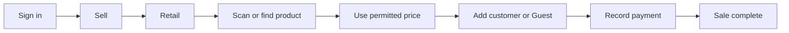
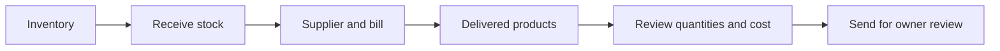
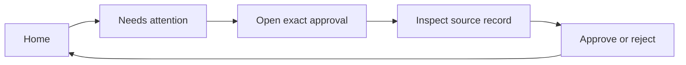
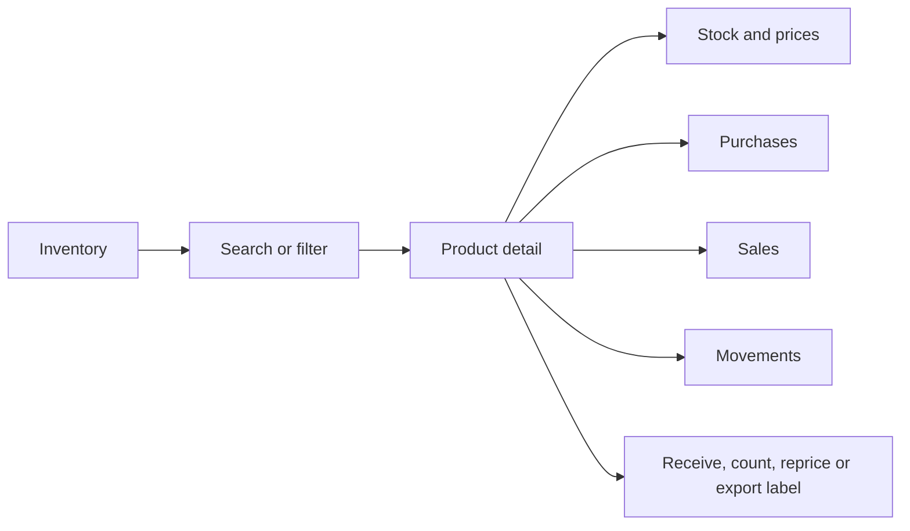
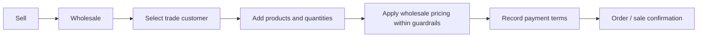

# ItsMyToy Product UX Restructure

Last verified: 30 July 2026

This document replaces feature-by-feature UI polishing as the governing product
structure. Existing business rules, stock safeguards, costing and audit evidence
remain valid. The presentation layer is being reorganized around shop jobs.

## 1. Assessment

The application has strong operational capabilities but presents too many of
them together. Users currently have to understand how the system was built
before they can understand what to do.

Observed locally at a 1280 × 720 desktop viewport:

| Current page | Page content height | Visible workspace | Main issue |
|---|---:|---:|---|
| Home | 4,408 px | 660 px | Dashboard, MIS, stock checks and actions compete |
| Sell | 1,417 px | 660 px | Product search, cart and checkout form one long page |
| Inventory | 741 px | 660 px | List, detail, counts, history and labels share one screen |
| Customers | 772 px | 660 px | Directory and full customer profile share one screen |
| Receive stock | 731 px | 660 px | Daily receiving and exceptional setup are mixed |
| Activity | 6,320 px | 660 px | Fifty records render as a long card feed |
| Approvals | 781 px | 660 px | Four unrelated approval types stack vertically |
| Reports | 846 px | 660 px | Useful signals exist but lack report-level navigation |
| Daily closing | 1,322 px | 660 px | Position, previous result and form stack together |
| Team & devices | 1,008 px | 660 px | Invitations, members and devices stack together |

### Root causes

1. Navigation represents features instead of business modules.
2. Primary lists and full record details are displayed on the same route.
3. Dashboard content duplicates reports instead of linking to them.
4. High-frequency tasks and rare administrative controls have equal visual
   weight.
5. Cards are used as the default container instead of a meaningful summary.
6. Actions do not consistently link to their source record or next step.
7. Desktop screens use long page scroll where subpages, tabs or pagination are
   more appropriate.
8. Mobile layouts shrink the same page instead of presenting one decision at a
   time.

## 2. Product principles

1. One page has one main job.
2. A list and a full record detail do not share the same desktop page.
3. Maximum four summary metrics at the top of a module.
4. Primary actions remain visible; secondary actions use a menu or modal.
5. Full workflows use pages. Quick edits, confirmations and small forms use
   modals.
6. Every summary links to the underlying records.
7. Desktop tables become mobile cards without losing actions or labels.
8. Global page scroll is reserved for reports and long record histories.
9. Business wording is used instead of database, policy or transaction wording.
10. Retail and Wholesale share stock truth but have separate selling journeys.

## 3. Target sitemap

```mermaid
flowchart TD
  App["ItsMyToy Operations"]
  App --> Home["Home"]
  App --> Sell["Sell"]
  App --> Inventory["Inventory"]
  App --> Customers["Customers"]
  App --> Reports["Reports"]
  App --> Operations["Operations"]
  App --> Settings["Settings"]

  Home --> Today["Today"]
  Home --> Queue["Needs attention"]

  Sell --> Retail["Retail sale"]
  Sell --> Wholesale["Wholesale sale"]
  Sell --> SaleHistory["Sales history"]
  Sell --> SaleDetail["Sale detail / receipt"]

  Inventory --> Products["Products"]
  Products --> ProductDetail["Product detail"]
  ProductDetail --> ProductOverview["Overview"]
  ProductDetail --> Purchases["Purchase history"]
  ProductDetail --> ProductSales["Sales history"]
  ProductDetail --> Movements["Stock movements"]
  Inventory --> Receive["Receive stock"]
  Inventory --> Counts["Stock counts"]
  Inventory --> Labels["Labels CSV"]

  Customers --> Directory["Customer directory"]
  Directory --> CustomerDetail["Customer detail"]
  CustomerDetail --> CustomerPurchases["Purchase history"]
  CustomerDetail --> NewCustomerSale["Start sale"]

  Reports --> ReportOverview["Overview"]
  Reports --> SalesReport["Sales"]
  Reports --> InventoryReport["Inventory"]
  Reports --> CustomerReport["Customers"]

  Operations --> Approvals["Approvals"]
  Approvals --> PriceApproval["Price requests"]
  Approvals --> CountApproval["Stock differences"]
  Approvals --> GuestApproval["Guest exceptions"]
  Approvals --> OfflineApproval["Offline conflicts"]
  Operations --> Closing["Daily closing"]
  Operations --> Activity["Activity log"]

  Settings --> Team["Team members"]
  Settings --> Devices["Devices"]
  Settings --> Business["Business settings"]
```

Purchasing, purchase orders, supplier balances, GST invoices, receivables,
dispatch and WhatsApp automation remain later modules. They must not be
represented as working navigation until their business rules exist.

## 4. Role journeys

### Store operator: retail sale

The operator sees stock, permitted prices and the checkout outcome. Cost,
margin and owner-only controls stay hidden.

### Trusted operator: receive delivery

Stock remains unchanged until the owner completes the receipt.

### Owner: start the day and resolve risk

Home shows only today, urgent decisions and stock risk. Detailed trends belong
in Reports.

### Owner: investigate one SKU

### Owner: wholesale sale

Payment terms, receivables, quotations and dispatch remain future work. The
current journey ends as a completed wholesale sale with an identified customer.

## 5. SWOT analysis

| Strengths | Weaknesses |
|---|---|
| Real stock, price, costing and audit rules already exist | Feature-led navigation hides the business journey |
| Retail and Wholesale are already separated in selling | Dense pages mix overview, action and history |
| Role controls protect owner-only information | Excessive cards and long scrolling reduce hierarchy |
| Inventory movements and historical sale snapshots are reliable | List/detail screens have no durable URLs |
| Local data is sufficient for realistic testing | Related records are not consistently connected |
| Desktop and mobile foundations already exist | Empty and exceptional states consume daily-work space |

| Opportunities | Threats |
|---|---|
| Job-based modules can reuse the existing backend | A visual rewrite could accidentally weaken safeguards |
| Record routes create direct, testable links | Route churn can break bookmarks and redirects |
| Modals can remove rare controls from daily screens | Too many modals can hide context or create nested flows |
| Reports can absorb dashboard clutter | Building future ERP features before current flows are usable |
| Mobile can present one decision at a time | Polishing components without testing complete journeys |
| Contextual actions can connect modules naturally | Hiding important cost or stock evidence for visual simplicity |

## 6. Module page contracts

### Home

**Purpose:** Tell the owner what happened today and what needs action.

Keep:

- Revenue, orders, units and gross product profit
- One combined action queue
- Out-of-stock and low-stock warnings
- Links to Reports, Inventory and Operations

Move out:

- Detailed payment breakdown → Reports / Sales
- Sales by person → Reports / Sales
- Catalogue-quality checks → Inventory / Overview
- Long stock review → Reports / Inventory

### Sell

**Purpose:** Complete one sale.

Subpages:

- Retail
- Wholesale
- Sales history
- Sale detail / receipt

Desktop:

- Product lookup on the left
- Cart and checkout on the right
- Customer and payment open as focused steps or modals

Mobile:

- Search → product → cart → customer → payment → receipt
- Sticky cart total and Continue action

### Inventory

**Purpose:** Know stock truth and act on one product.

Subpages:

- Products
- Product detail
- Receive stock
- Stock counts
- Labels CSV

Products page:

- Search, filters and product table only
- Four metrics maximum
- Clicking a product opens its own route

Product detail:

- Overview, Purchases, Sales and Movements tabs
- Receive, Count and Change price actions
- Small edits use modals

### Customers

**Purpose:** Find a customer and understand the relationship.

Subpages:

- Directory
- Customer detail

Directory:

- Search, customer type filters and list only

Customer detail:

- Contact information
- Retail / Wholesale pattern
- Lifetime value and last purchase
- Purchase history
- Start sale action

### Reports

**Purpose:** Answer a business question, not operate a transaction.

Subpages:

- Overview
- Sales
- Inventory
- Customers

Rules:

- Every metric states its date range
- Every summary links to the filtered records
- Charts show trends; tables provide the underlying values
- No operational forms inside Reports

### Operations

**Purpose:** Resolve exceptions and close the shop day.

Subpages:

- Approvals
- Daily closing
- Activity log

Approvals:

- Separate tabs by approval type
- Show only pending records by default
- Open decision details in one modal

Activity:

- Table on desktop, cards on mobile
- Pagination instead of a fifty-card page
- Filters remain in the URL

Daily closing:

- Current system position
- One reconciliation form
- Prior closings move to a history subpage or modal

### Settings

**Purpose:** Rare administrative configuration.

Subpages:

- Team members
- Invitations
- Devices
- Business settings

Settings never appears inside daily transaction screens.

## 7. Modal and page rules

Use a modal for:

- Add or edit supplier
- Add or edit customer
- Change product price or rack
- Enter physical count
- Approval decision
- Confirmation before irreversible completion

Use a full page for:

- New sale
- Receive stock
- Product detail
- Customer detail
- Reports
- Daily closing
- Multi-step setup

Never:

- Open a modal from another modal
- Put long history inside a modal
- Hide the only copy of important stock or money evidence in a modal

## 8. Cross-module connectivity

| From | Link or action | Destination |
|---|---|---|
| Home action queue | Review | Exact approval |
| Home stock warning | View products | Filtered Inventory |
| Inventory product | Open | Product detail |
| Product detail | Receive this SKU | Receive stock with SKU selected |
| Product detail | Export label | Labels with SKU selected |
| Product sale history | Open sale | Sale detail |
| Customer detail | Start Retail / Wholesale sale | Sell with customer selected |
| Report metric | View records | Filtered list or activity |
| Activity record | Open source | Sale, receipt, count or approval |
| Completed sale | View customer | Customer detail |

## 9. Responsive behavior

### Desktop

- Persistent module navigation
- Contextual subnavigation below the top bar
- Page content fits one primary viewport where practical
- Tables paginate or scroll inside their bounded content area
- Full record details use a separate route

### Mobile

- Four primary destinations: Home, Sell, Inventory and Customers
- Reports, Operations and Settings live under More
- Contextual subnavigation scrolls horizontally
- One content column and one primary action
- Tables become labelled cards
- Full-screen modal sheets for small forms and confirmations

## 10. Implementation sequence

1. **Navigation foundation**
   - Seven business modules
   - Contextual subnavigation
   - Existing routes remain functional
2. **Inventory split**
   - Product list
   - Product detail route and tabs
   - Receive, Counts and Labels subpages
3. **Sales split**
   - Retail and Wholesale routes
   - Cart / customer / payment steps
   - Sales history and receipt routes
4. **Customers split**
   - Directory
   - Customer detail route
5. **Reports split**
   - Overview, Sales, Inventory and Customer reports
6. **Operations split**
   - Approval tabs
   - Closing
   - Paginated activity
7. **Settings split**
   - Team, invitations, devices and business settings
8. **Journey verification**
   - Owner, trusted operator and store operator
   - Desktop and mobile
   - No production deployment until local acceptance

## 11. Acceptance standard

A module is not complete because its components look polished. It is complete
when a first-time shop user can:

1. Identify the page purpose in five seconds.
2. Find the primary action without scrolling.
3. Complete the journey without knowing system terminology.
4. Return to the source record from a summary or alert.
5. Repeat the same journey on mobile without desktop-only assumptions.

